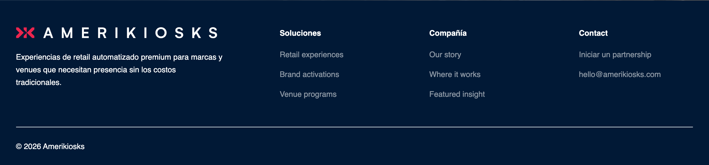
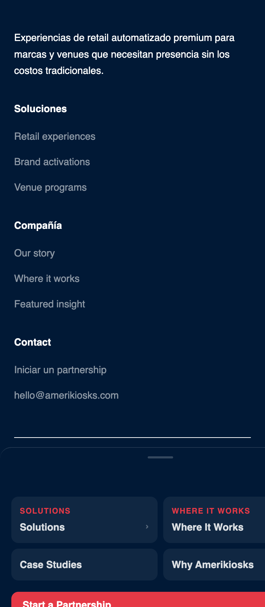

# Footer

> Site-wide footer with brand description, navigation columns, and contact information. Appears at the bottom of every page.

## Admin Location
- **Ruta:** `Globals → Footer`
- **Tipo:** `Global`

## Fields

| Campo | Tipo | Requerido | Localizado | Descripción |
|-------|------|-----------|------------|-------------|
| `brandDescription` | textarea | ✗ | ✗ | Short tagline shown below the logo |
| `columns` | array (max 4) | ✗ | ✗ | Navigation link columns |
| `columns[].label` | text | ✓ | ✗ | Column heading |
| `columns[].links` | array (max 8) | ✗ | ✗ | Links within this column |
| `contactEmail` | email | ✗ | ✗ | Contact email address |
| `contactCta` | text | ✗ | ✗ | Contact call-to-action label |
| `contactCtaUrl` | text | ✗ | ✗ | Contact CTA URL |

## Variants

| Variante | Descripción |
|----------|-------------|
| Standard | Logo + description + nav columns + contact |

## Screenshots

| Desktop (1280px) | Mobile (375px) |
|------------------|----------------|
|  |  |

## Quality Checklist

**Completeness: 6/20 (30%)**

### Accessibility AAA
- [ ] Contrast ratio minimum 7:1
- [ ] All interactive elements keyboard navigable
- [ ] ARIA labels on elements without visible text
- [x] Correct HTML landmarks (`<footer>`)
- [ ] Focus visible on all interactive elements

### HTML Semantics
- [ ] Correct heading hierarchy (no skipped levels)
- [x] Semantic elements used (`<footer>`, `<ul role="list">`)
- [ ] Images have descriptive `alt` text

### Performance
- [ ] Images use `next/image` with correct sizes
- [ ] No Cumulative Layout Shift (CLS)
- [ ] Off-viewport content lazy loaded

### SEO / AIO / GEO
- [ ] Content directly answers questions (GEO-ready)
- [ ] Schema.org implemented
- [x] Does not block indexing

### Delivery
- [ ] Unit tests added
- [x] All fields documented in table above
- [ ] Screenshots up to date
- [ ] Delivery notes written in non-technical language

## Schema.org

- **Applicable type:** `WPFooter`
- **Implemented:** ✗
- **Snippet:**

```json
{
  "@context": "https://schema.org",
  "@type": "WPFooter"
}
```

## Delivery Notes

> The Footer appears at the bottom of every page. You can edit it from **Globals → Footer** in the admin panel. Add a short brand tagline below the logo, up to 4 navigation columns (each with up to 8 links), and a contact section with an email address and a call-to-action button. Changes take effect immediately after saving.
