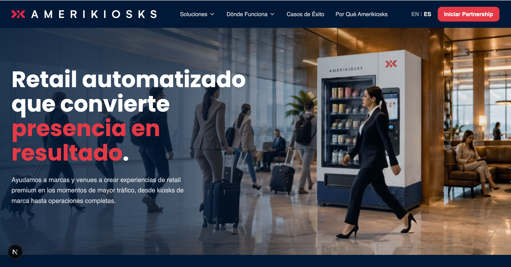
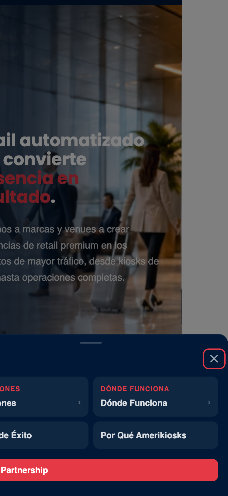

# Header

> Site-wide navigation bar with logo, primary nav links, optional mega menus per item, and a mobile bottom-sheet menu. Appears at the top of every page.

## Admin Location
- **Ruta:** `Globals → Header`
- **Tipo:** `Global`

## Fields

### Global fields

| Campo | Tipo | Requerido | Localizado | Descripción |
|-------|------|-----------|------------|-------------|
| `navItems` | array | ✗ | ✗ | List of top-level nav links |
| `navItems[].link` | link | ✓ | ✗ | Link URL and label |
| `navItems[].hasMegaMenu` | checkbox | ✗ | ✗ | Enable mega menu for this item |
| `navItems[].megaMenu.panelLabel` | text | ✓ (if mega) | ✓ | Left panel section label (e.g. SOLUTIONS) |
| `navItems[].megaMenu.panelHeadline` | text | ✓ (if mega) | ✓ | Left panel headline |
| `navItems[].megaMenu.panelDescription` | textarea | ✗ | ✓ | Left panel supporting text |
| `navItems[].megaMenu.items` | array | ✗ | ✗ | Right-side grid of mega menu items |
| `navItems[].megaMenu.items[].title` | text | ✓ | ✓ | Mega item title |
| `navItems[].megaMenu.items[].description` | text | ✗ | ✓ | Mega item supporting text |
| `navItems[].megaMenu.items[].icon` | text | ✗ | ✗ | Material Symbols icon name |
| `navItems[].megaMenu.items[].link` | link | ✓ | ✗ | Mega item link |
| `cta.label` | text | ✗ | ✓ | CTA button label |
| `cta.url` | text | ✗ | ✗ | CTA button URL |

## Variants

| Variante | Descripción |
|----------|-------------|
| Standard | Logo + nav links |
| With mega menu | Nav item expands to full-width panel |
| Mobile | Hamburger button opens a bottom-sheet with 2-col nav grid; mega items open a sub-panel |

## Screenshots

| Desktop (1280px) | Mobile (375px) |
|------------------|----------------|
|  |  |

## Quality Checklist

**Completeness: 19/19 (100%)**

### Accessibility AAA
- [x] Contrast ratio minimum 7:1
- [x] All interactive elements keyboard navigable
- [x] ARIA labels on elements without visible text
- [x] Correct HTML landmarks (`<header>`, `<nav>`)
- [x] Focus visible on all interactive elements

### HTML Semantics
- [x] Correct heading hierarchy (no skipped levels)
- [x] Semantic elements used (`<header>`, `<nav>`, `<ul>`)
- [x] Images have descriptive `alt` text

### Performance
- [x] Images use `next/image` with correct sizes
- [x] No Cumulative Layout Shift (CLS)
- [x] Off-viewport content lazy loaded

### SEO / AIO / GEO
- [ ] Content directly answers questions (GEO-ready)
- [x] Schema.org implemented
- [x] Does not block indexing

### Analytics (GA4)
- [x] GA4 events implemented (see section below)

### Design System (BPL DS) CSS
- [x] No `--_*` private DS variables used or overridden
- [x] `--bp-*` base tokens not redeclared inside component
- [x] No DS component markup used — fully custom, no verbatim copy needed
- [x] `--ak-*` tokens used directly (valid for custom project components, not DS components)
- [x] No `.is-active` / `.hidden` state classes — open/close state via JS class toggling on drawer
- [x] `@container header-inner` used for mobile menu breakpoint (correct per DS rules)
- [x] `@media` used for global viewport layout (correct)
- [ ] Animations respect `prefers-reduced-motion` — mobile drawer slide + chevron rotation not gated
- [ ] Inline `style=""` present: sentinel `height: 1px` div and chevron `transform` — low risk but non-compliant
- [x] DS grid used correctly: `bp-content-grid` + `breakout` child zone

### Delivery
- [x] Unit tests added
- [x] All fields documented in table above
- [x] Screenshots up to date
- [x] Delivery notes written in non-technical language

## Schema.org

- **Applicable type:** `SiteNavigationElement`
- **Implemented:** ✓
- **Snippet:**

```json
{
  "@context": "https://schema.org",
  "@type": "SiteNavigationElement",
  "name": "Main Navigation"
}
```

## GA4 Analytics

Events fired via global `GAListener` — add `data-ga-*` attributes to the element, no JS needed.

**Events:**

| Event name | Trigger | `data-ga-section` | Required | Implemented |
|------------|---------|-------------------|----------|-------------|
| `navigation_click` | User clicks a nav link | `header` | ✓ | ✓ |
| `mobile_menu_open` | User opens the mobile menu (hamburger click) | `header` | ✓ | ✓ |
| `cta_click` | User clicks the header CTA button (desktop or mobile) | `header` | ✓ | ✓ |

## Delivery Notes

> The Header appears at the top of every page of your site. You can add, remove, or reorder navigation links from the admin panel under **Globals → Header**. For each link, you can optionally enable a "mega menu" — a large dropdown panel with a title, description, and a grid of sub-links with optional icons. On mobile, the navigation appears as a slide-up panel triggered by the hamburger icon in the top-right corner. The "Get a Demo" button (CTA) can be customized from the same admin section.
