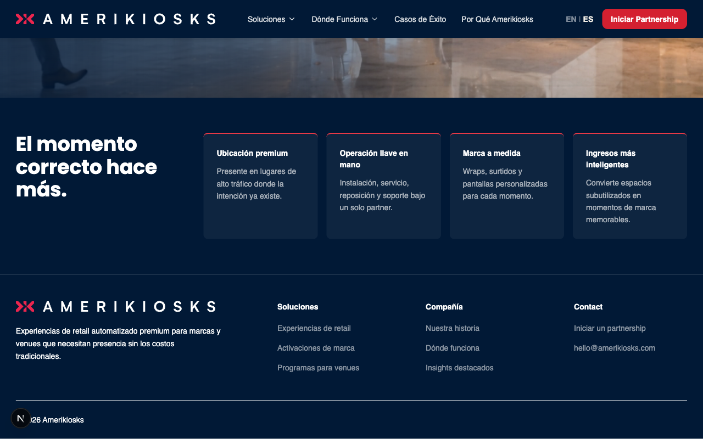
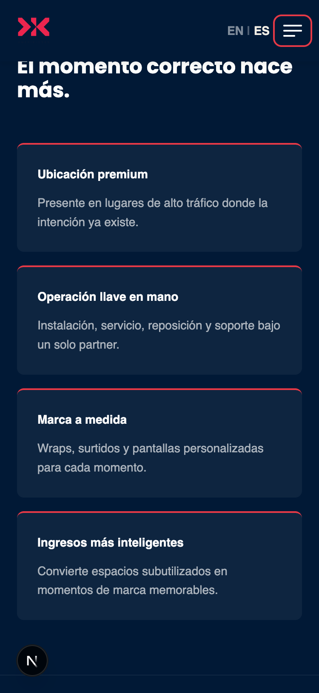

# ValueProps

> Dark-background section with a left heading and a grid of up to 6 benefit cards. Used to communicate key differentiators on the home page.

## Admin Location
- **Ruta:** `Pages → [page] → Layout → Value Props`
- **Tipo:** `Layout Block`

## Fields

| Campo | Tipo | Requerido | Localizado | Descripción |
|-------|------|-----------|------------|-------------|
| `heading` | text | ✓ | ✓ | Section heading shown in the left column |
| `items` | array (1–6) | ✓ | ✓ | Benefit cards |
| `items[].title` | text | ✓ | ✓ | Card title |
| `items[].body` | richText | ✗ | ✓ | Card supporting text |

## Variants

| Variante | Descripción |
|----------|-------------|
| Standard | 1fr/3fr grid — heading left, 4-col card grid right |

## Screenshots

| Desktop (1280px) | Mobile (375px) |
|------------------|----------------|
|  |  |

## Quality Checklist

**Completeness: 18/19 (95%)**

### Accessibility AAA
- [x] Contrast ratio minimum 7:1
- [x] All interactive elements keyboard navigable
- [x] ARIA labels on elements without visible text
- [x] Correct HTML landmarks (`<section aria-label>`)
- [x] Focus visible on all interactive elements

### HTML Semantics
- [x] Correct heading hierarchy (no skipped levels)
- [x] Semantic elements used (`<section>`, `<h2>`)
- [x] Images have descriptive `alt` text

### Performance
- [x] Images use `next/image` with correct sizes
- [x] No Cumulative Layout Shift (CLS)
- [x] Off-viewport content lazy loaded

### SEO / AIO / GEO
- [ ] Content directly answers questions (GEO-ready)
- [x] Schema.org implemented
- [x] Does not block indexing

### Analytics (GA4)
- [x] GA4 events implemented (see section below)

### Design System (BPL DS) CSS
- [x] No `--_*` private DS variables used or overridden
- [x] `--bp-*` base tokens not redeclared inside component
- [x] No DS component markup used — fully custom, no verbatim copy needed
- [x] All customisation via component-level CSS classes — no inline `style=""` attributes
- [x] `--ak-*` tokens used directly (valid for custom project components, not DS components)
- [x] No `.is-active` / `.hidden` state classes
- [x] Breakpoints use `@media` (full-viewport layout block — correct)
- [x] No animations — `prefers-reduced-motion` N/A
- [x] DS grid used correctly: `bp-content-grid` + `breakout` child zone

### Delivery
- [x] Unit tests added
- [x] All fields documented in table above
- [x] Screenshots up to date
- [x] Delivery notes written in non-technical language

## GA4 Analytics

No interactive elements — no click events required for this block.

**Events:**

| Event name | Trigger | `data-ga-section` | Required | Implemented |
|------------|---------|-------------------|----------|-------------|
| — | — | — | — | N/A |

## Schema.org

- **Applicable type:** `ItemList`
- **Implemented:** ✓
- **Snippet:**

```json
{
  "@context": "https://schema.org",
  "@type": "ItemList",
  "name": "Why Amerikiosks",
  "numberOfItems": 4
}
```

## Delivery Notes

> The Value Props section appears as a dark panel with a heading on the left and a grid of benefit cards on the right. To edit it, open the page in the admin panel, find the Value Props block in the Layout section, and update the heading and individual card titles and descriptions. You can have between 1 and 6 cards. Changes only go live after publishing.
