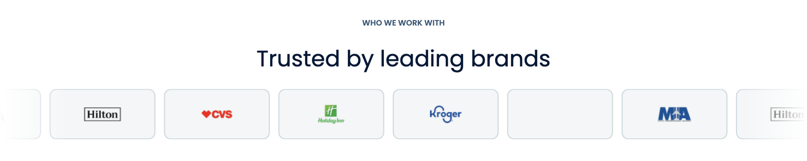
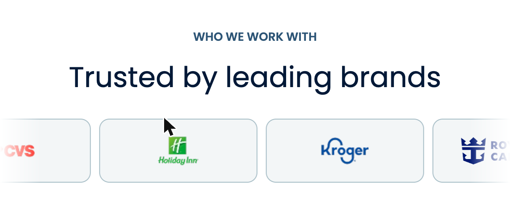

# Trust Strip

> Displays a scrolling logo carousel of partner brands. Use it to show "trusted by" social proof on any page.

## Admin Location
- **Ruta:** `Pages → [page] → Layout → Trust Strip`
- **Tipo:** `Layout Block`

## Fields

| Campo | Tipo | Requerido | Localizado | Descripción |
|-------|------|-----------|------------|-------------|
| `eyebrow` | text | ✗ | ✓ | Small label above the heading, e.g. "WHO WE WORK WITH" |
| `heading` | text | ✓ | ✓ | Main section heading |
| `limit` | number | ✗ | ✗ | Max partners to show. 0 or empty = show all |

### Partners Collection (managed separately)

Partners are managed at **Partners** in the main admin menu. Each partner has:

| Campo | Tipo | Requerido | Descripción |
|-------|------|-----------|-------------|
| `name` | text | ✓ | Brand name (used as image alt text) |
| `logo` | upload (Media) | ✓ | Brand logo image |
| `order` | number | ✗ | Display order — lower number appears first (1, 2, 3…) |

## Variants

| Variante | Descripción |
|----------|-------------|
| `default` | Infinite CSS marquee scrolling left at 40s, pauses on hover, edge fades |

## Screenshots

| Desktop (1280px) | Mobile (375px) |
|------------------|----------------|
|  |  |

## Quality Checklist

**Completeness: 11/21 (52%)**

### Accessibility AAA
- [ ] Contrast ratio minimum 7:1
- [ ] All interactive elements keyboard navigable
- [x] ARIA labels on elements without visible text — `aria-label={heading}` on `<section>`, `aria-hidden="true"` on duplicate track
- [x] Correct HTML landmarks — `<section>` with aria-label, `<ul>/<li>` for logo list
- [ ] Focus visible on all interactive elements

### HTML Semantics
- [ ] Correct heading hierarchy (no skipped levels)
- [x] Semantic elements used — `<section>`, `<ul>`, `<li>`
- [x] Images have descriptive `alt` text — partner `name` used as alt

### Performance
- [x] Images use `next/image` with correct sizes
- [ ] No Cumulative Layout Shift (CLS)
- [ ] Off-viewport content lazy loaded

### SEO / AIO / GEO
- [ ] Content directly answers questions (GEO-ready)
- [ ] Schema.org implemented
- [ ] Does not block indexing

### Analytics (GA4)
- [ ] GA4 events implemented

### Design System (BPL DS) CSS
- [ ] No `--_*` private DS variables used or overridden
- [x] `--bp-*` base tokens not redeclared inside components
- [ ] DS component markup copied verbatim (N/A — custom component)
- [ ] All DS component customisation via `--<component>-*` class variables only
- [x] `--ak-*` brand tokens used via CSS variables with fallbacks
- [x] No inline `style=""` attributes
- [x] Animations respect `prefers-reduced-motion`

### Delivery
- [x] Unit tests added
- [x] All fields documented in table above
- [ ] Screenshots up to date
- [ ] Delivery notes written

## GA4 Analytics

| Event name | Trigger | `data-ga-section` | Required | Implemented |
|------------|---------|-------------------|----------|-------------|
| `partner_logo_view` | Logo enters viewport | `trust_strip` | ✗ | ✗ |

## Schema.org

- **Applicable type:** N/A — logo strip is decorative social proof, no structured data required
- **Implemented:** ✗

## Delivery Notes

**Partners** live in their own section of the admin panel (top-level "Partners" menu item). To add or update a logo:
1. Go to **Partners** → **Create New**
2. Upload the logo image and enter the brand name
3. Set the **Order** number — lower numbers appear first in the carousel (1 = leftmost)

To add this section to a page:
1. Open the page → **Content** tab → **Add Block** → **Trust Strip**
2. Fill in the **Eyebrow** (optional small label) and **Heading**
3. Leave **Limit** empty to show all partners, or enter a number to cap the count
