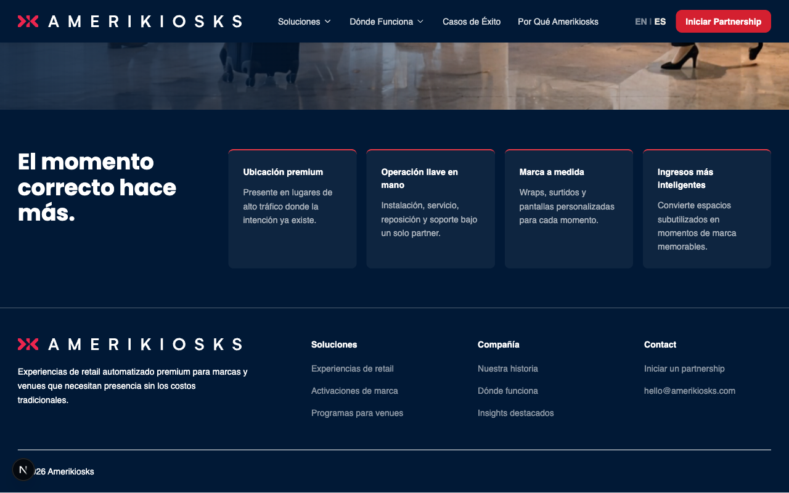

# Hero — High Impact

> Full-viewport hero section with background video (or image fallback), rich text content, and CTA links. Used as the primary above-the-fold section on the home page.

## Admin Location
- **Ruta:** `Pages → [page] → Hero → Type → High Impact`
- **Tipo:** `Hero Variant (field group on Pages collection)`

## Fields

| Campo | Tipo | Requerido | Localizado | Descripción |
|-------|------|-----------|------------|-------------|
| `type` | select | ✓ | ✗ | Hero variant: `highImpact`, `mediumImpact`, `lowImpact`, `none` |
| `richText` | richText | ✗ | ✓ | Main headline and supporting text |
| `links` | linkGroup (max 2) | ✗ | ✗ | CTA buttons |
| `media` | upload (media) | ✓ | ✗ | Background image — renders with `priority`, also used as video poster |
| `backgroundVideo` | upload (media) | ✗ | ✗ | Background video (MP4). Plays muted + looped over the image |

## Variants

| Variante | Descripción |
|----------|-------------|
| `highImpact` | Full-viewport, dark theme, video/image background |
| `mediumImpact` | Two-column layout with image (separate component) |
| `lowImpact` | Text-only, no media (separate component) |
| `none` | No hero rendered |

## Screenshots

| Desktop (1280px) | Mobile (375px) |
|------------------|----------------|
|  |  |

## Quality Checklist

**Completeness: 8/21 (38%)**

### Accessibility AAA
- [ ] Contrast ratio minimum 7:1
- [ ] All interactive elements keyboard navigable
- [x] ARIA labels on elements without visible text
- [x] Correct HTML landmarks (`<section>`)
- [ ] Focus visible on all interactive elements

### HTML Semantics
- [ ] Correct heading hierarchy (no skipped levels)
- [x] Semantic elements used (`<section>`, `<ul>` for actions)
- [ ] Images have descriptive `alt` text

### Performance
- [x] Images use `next/image` with correct sizes (`<Media priority>`)
- [ ] No Cumulative Layout Shift (CLS)
- [ ] Off-viewport content lazy loaded

### SEO / AIO / GEO
- [ ] Content directly answers questions (GEO-ready)
- [ ] Schema.org implemented
- [x] Does not block indexing

### Analytics (GA4)
- [x] GA4 events implemented (see section below)

### Delivery
- [ ] Unit tests added
- [x] All fields documented in table above
- [ ] Screenshots up to date
- [x] Delivery notes written in non-technical language

## GA4 Analytics

Events fired via global `GAListener` — add `data-ga-*` attributes to the element, no JS needed.

**Events:**

| Event name | Trigger | `data-ga-section` | Required | Implemented |
|------------|---------|-------------------|----------|-------------|
| `hero_cta_click` | User clicks a CTA button | `hero_high_impact` | ✓ | ✓ |
| `hero_video_play` | User interacts with video | `hero_high_impact` | ✗ | ✗ |

## Schema.org

- **Applicable type:** `WebPageElement` / `ImageObject` (for media)
- **Implemented:** ✗
- **Snippet:**

```json
{
  "@context": "https://schema.org",
  "@type": "WebPageElement",
  "cssSelector": ".ak-hero-home"
}
```

## Delivery Notes

> The High Impact Hero is the large full-screen banner at the top of a page. To edit it, go to **Pages**, open the page, and scroll to the **Hero** section. Select "High Impact" from the Type dropdown. Upload a background image (used as fallback and video poster), optionally upload a background video (MP4 format), write your headline and supporting text in the rich text editor, and add up to 2 CTA buttons. Changes are saved as a draft and only go live when you click **Publish**.
